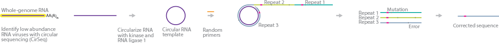

# Exercise 2b

### Github Usernames

* cell0126
* licrone

### Circular sequencing (CirSeq)

Summary:

As NGS with bacterium free cloning is not accurate enough to detect rare mutations in viruses, CirSeq uses a different amplification method. RNA fragments are circulized and then cDNA is produced via rolling circle reverse transcription. As there are now multiple linked copies of an RNA fragment, there sequences can be compared and sequencing errors can be detected.

Technology:
* circularisation of RNA
* rolling-circle reverse transcription creates linked repeats of genomic material from one individual virus in the population

Application:
Understanding evolution of virus populations including low-frequency mutations which are inadequatley detected with NGS

Statistics:
* As part of the method: comparing the different repeats helps to differentiate between sequencing errors and low-frequency mutations;  quality score Q=-10log(e), where e is the error probability
* To show the usefulness and accuracy of the method: mutation frequencies and transition-to-transversion ratios of polio viruses was determined and compared to previous and expected results, fitness distributions for mutations
* For the study of the virus population: one-sided binomial test to determine significance of mutations, p value to determine wheter the mutation being beneficial is significant

#### Sources:
* [Original paper](https://www.nature.com/articles/nature12861)
* [Summary by Illumina](https://www.illumina.com/science/sequencing-method-explorer/kits-and-arrays/cirseq.html)

# Exercise 2a

### 10x Visium
10x Visium is a spatial transcriptomics technique. It can be used to determine the concentration of RNAs in different parts of a tissue. On one slide there are four capture areas on which tissue can be placed. In the capture area there are barcoded spots with oligonucleotides. The tissue is fixed and permeabalized and the RNA binds to the oligonucleotides, cDNA is synthesized and sequenced. 

### Resources:
* [10x Company Website](https://www.10xgenomics.com/products/spatial-gene-expression)
* [Description by FGZ](https://fgcz.ch/omics_areas/transcriptomics_uc/applications/Spatial-transcriptomics.html)
* [An application of the technique - see supplementary material](https://www.biorxiv.org/content/10.1101/2020.11.17.386458v2)
* [An explanation video by 10x](https://www.youtube.com/watch?v=VwNk4d-0RJc)
