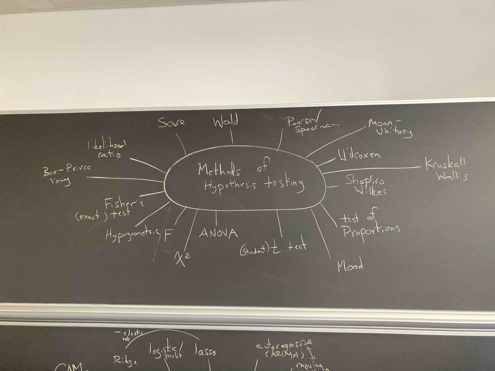
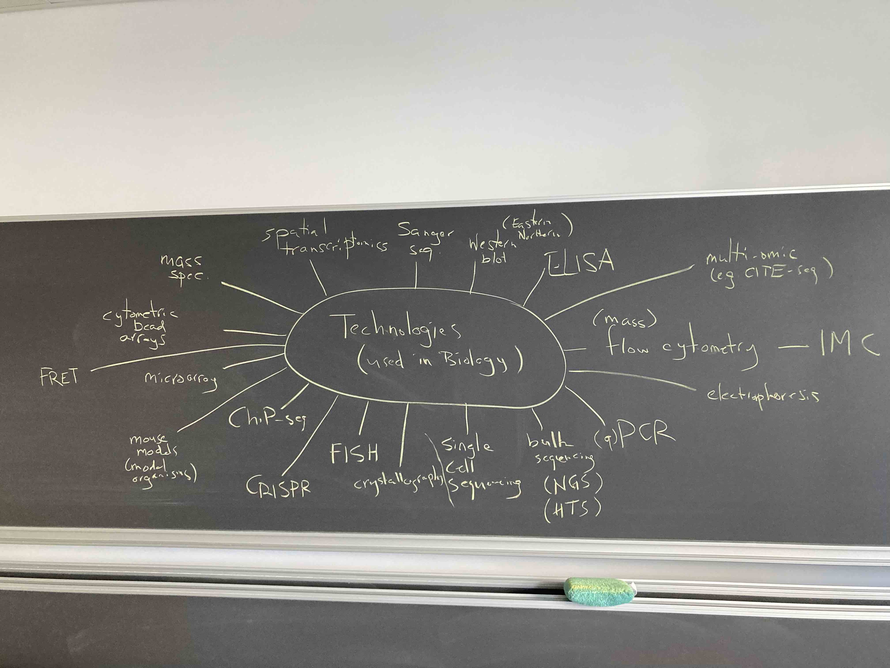

# Part 1 - Brainstorm: Statistics

## Distributions


## Statistical Models


## Methods for Estimation


## Methods for Hypothesis Testing


# Part 2 - Brainstorm: Omics Technologies in Biology


```{r}
techs <- c("illumina-rna-seq",
           "bisulphite-seq", "mass-spec", 
           "10x-chromium", "oxford-nanopore")

online <- c("microarray")

s <- sample(length(techs))
df <- data.frame(row=c(0,s), tech=c(online,techs))
o <- order(df$row)
df[o,]
```


```
  row             tech
1   0       microarray
3   1   bisulphite-seq
5   2     10x-chromium
4   3        mass-spec
2   4 illumina-rna-seq
6   5  oxford-nanopore
```

___
## Exercise 2 part a (as a group)
#### produce a 2-3 point summary of "how it works"
#### links to a few (<5) good resources
#### create a markdown file for your description and make it your README.md in the "group assignment" repo
#### (choose how to share the work in your group)
___

# Part 3 - Brainstorm: Applications in genomics 


# Part 4 - Brainstorm: Linking Technologies to Applications to Statistics


#### e.g., microarray -> gene expression -> normally distributed (log intensities)

# Part 5 - Pick a *Technology*/*Application* from [*Seq](https://liorpachter.wordpress.com/seq/) (or find another newer one not in the list) and ..

___
## Exercise 2 part b (in same groups): pick a *Technology*/*Application* from [*Seq](https://liorpachter.wordpress.com/seq/) (or find another newer one not in the list) and ..
#### write ~3 sentences about what the method does and what it is used for
#### make the link (technology -> application -> statistics)
#### create a markdown file (name it with the selected technology) with the description
#### list the github usernames of everyone in your group
#### fork the [material](https://github.com/sta426hs2021/material) repo
#### add your markdown file to the `week02-27sep2021` directory of the fork
#### send a pull request to the master repo of `material`
___

